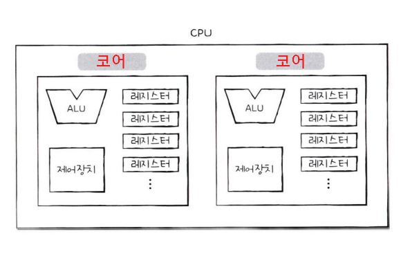

## 진도 : Chapter 04 ~ 05

## 기본 숙제   
1. **p. 125의 확인 문제 2번**   
* `플래그 레지스터` : 연산 결과 혹은 CPU 상태에 대한 부가 정보를 저장하는 레지스터
* `프로그램 카운터` : 메모리에서 가져올 명령어의 주소를 저장하는 레지스터
* `범용 레지스터` : 데이터와 주소를 모두 저장할 수 있는 레지스터
* `명령어 레지스터` : 해석할 명령어를 저장하는 레지스터
2. **p. 155의 확인 문제 4번**   

## 추가 숙제
**Ch.05(05-1) 코어와 스레드, 멀티 코어와 멀티 스레드의 개념을 정리하기**   
### 코어
기존에 CPU의 의미였던 `명령어를 실행하는 부품`은 오늘날 코어의 의미가 되었다.
### 스레드
사전적 의미는 `실행 흐름의 단위`이다.
* 하드웨어적 스레드 : 하나의 코어가 동시에 처리하는 명령어 단위 (논리 프로세서)
* 소프트웨어적 스레드 : 하나의 프로그램에서 독립적으로 실행되는 단위
### 멀티 코어 (병렬성)
하나의 CPU가 여러개의 코어를 포함하고 있는 경우 `멀티 코어 CPU` 또는 `멀티 코어 프로세스`부른다.
### 멀티 스레드 (동시성)
`레지스터 세트`(하나의 명령어를 실행하기 위해 꼭 필요한 레지스터들)을 여러개 가지고 있는 CPU. 하나의 코어로 여러개의 명령어를 동시에 실행할 수 있다.